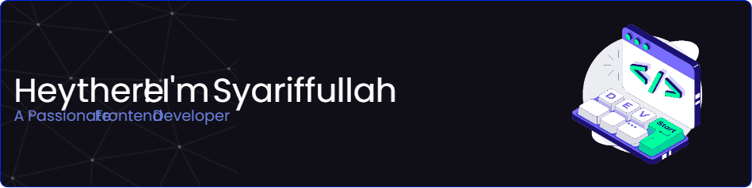

<!--
**Areeep/Areeep** is a ✨ _special_ ✨ repository because its `README.md` (this file) appears on your GitHub profile.

Here are some ideas to get you started:

- 🔭 I’m currently working on ...
- 🌱 I’m currently learning ...
- 👯 I’m looking to collaborate on ...
- 🤔 I’m looking for help with ...
- 💬 Ask me about ...
- 📫 How to reach me: ...
- 😄 Pronouns: ...
- ⚡ Fun fact: ...
-->
<!---  -->

  <ul style="list-style: none">
    

      <h1>Hey there!👋🏻</h1>
      
I'm <a href="www.linkedin.com/in/syariffullah">Syariffullah</a>, a Frontend Developer based in Indonesia.

    

  </ul>

 

I design and build whatever i can imagine.

✨ Currently focusing on crafting clean UI, smooth animations, and delightful user experiences.

 <h4>My main stack is React.js, Tailwind CSS and GSAP.   My favorite tools are Figma and Visual Studio Code on my laptop.</h4>

I enjoy exploring new ideas, experimenting with animations, and continuously improving my skills.

When I'm not coding, you'll probably find me listening to music, watching movies, playing games, or scrolling for learn something new and inspiration.

 

<a href="https://www.instagram.com/areeplh/">@areeplh</a>
 
<a href="www.linkedin.com/in/syariffullah">in/syariffullah</a>

<!--  -->
